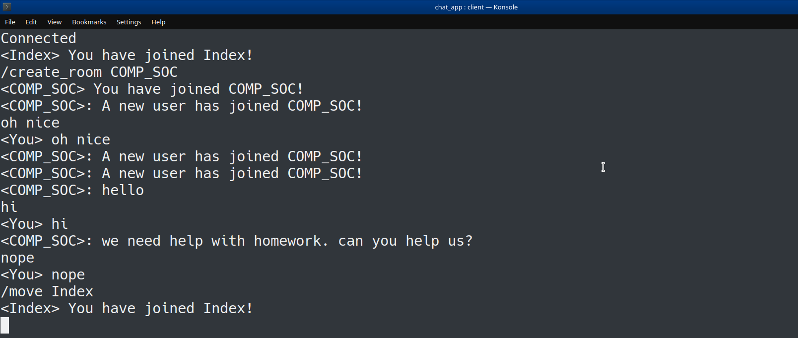

## Echo Chat

Echo Chat is a simple terminal chat application which focuses 
on user customisation. 
 
## Installation

1. Download and install the Boost ASIO library
2. Install SQLite3 for C++  
`sudo apt-get install libsqlite3-dev
`

## Running Echo

In the root directory of the project, run the following
commands in the terminal.

1| Build the project.

`cmake CMakeLists.txt`

`make`

 2| Run the server and client executables.

`./server <port num> `

`./client <port num>`

## Summary
- Asynchronous communication.

- Threads used for accepting new connections.

- User can create and join rooms.

